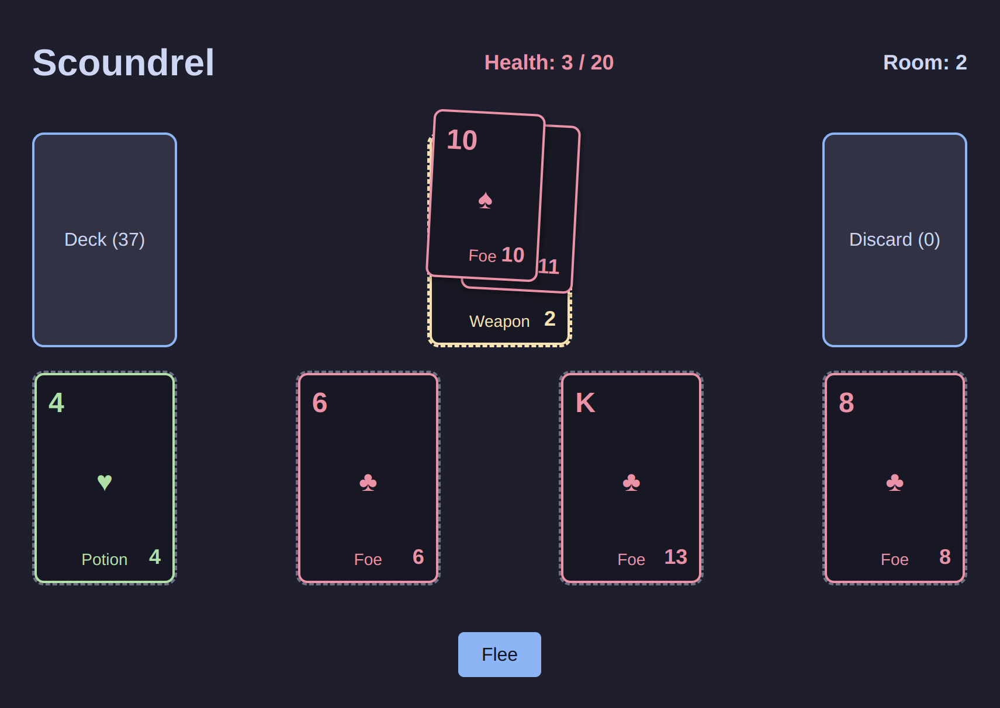

# Scoundrel

A roguelike solitaire card game built with Elm. This project was developed as an experiment to explore Cursor AI as a programming assistant.

## About

Scoundrel combines elements of solitaire card games with light roguelike mechanics. The development process was focused on using Cursor AI to assist with code generation, problem-solving, and implementation.

The game features a simple but engaging gameplay loop where you navigate through a dungeon by managing cards representing weapons, potions, and foes.

## Technologies

- [Elm](https://elm-lang.org/) - A delightful language for reliable web applications
- [Cursor](https://cursor.sh/) - AI-powered code editor
- CSS for styling and visual effects
- Custom drag and drop mechanics

## Development Process

This project showcases the capabilities of AI-assisted development. Cursor was used to:
- Generate initial code structures
- Debug type issues in Elm
- Implement game mechanics
- Design the visual styling

The experiment demonstrates both the strengths and limitations of current AI coding tools when working with strongly typed functional languages like Elm.

## Getting Started

### Prerequisites

- [Elm](https://guide.elm-lang.org/install/elm.html) (version 0.19.1 or later)
- A modern web browser

### Running the Game

1. Clone this repository
2. Navigate to the project directory
3. Run `elm reactor`
4. Open `http://localhost:8000/src/Main.elm` in your browser

Then open `public/index.html` in your browser.

## How to Play

- Draw cards from the deck to fill the room
- Use potions to heal
- Equip weapons to fight foes
- Stack foes of lower rank on your weapon
- Discard your weapon when you're done with it
- Flee the room if you're in trouble (but you can only flee once)

The goal is to defeat all foes while managing your health.

## Credits

The original Scoundrel game rules were authored by Zach Gage and Kurt Bieg. You can learn more about the original game at [stfj.net](http://stfj.net/index2.php?year=2011&project=art/2011/Scoundrel.pdf).

This implementation is a tribute to their innovative design.

### Building for Production
